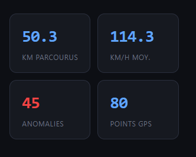
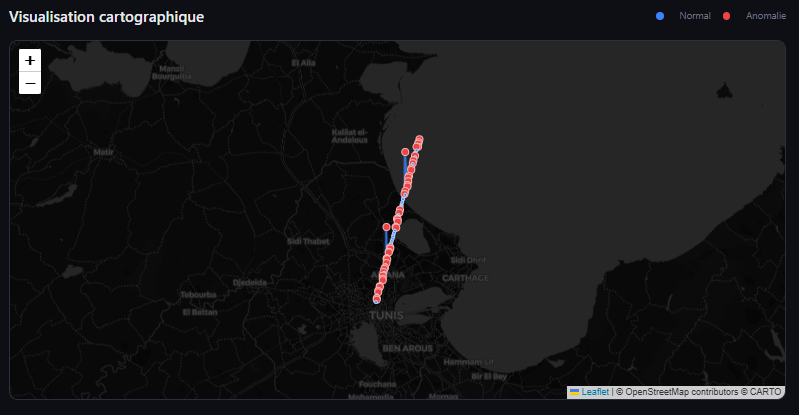
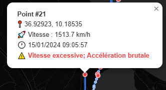

# 🛰️ Mobility Analytics Platform

> A fullstack web application for GPS trajectory analysis — computing speed, distance, anomaly detection, and interactive map visualization in real time.


---

## 📸 Screenshots

### Home — Hero Section


### Real-time Metrics after Analysis


### Interactive Map — Trajectory with Anomalies Highlighted


### Anomaly Popup — Excessive Speed Detected


### File Upload — Drag & Drop Interface


---

## 🎯 Context & Motivation

This project applies concepts from **spatio-temporal data analysis to real-world mobility use cases**. It demonstrates how to automate the extraction of meaningful indicators (distance, speed, anomalies) from raw GPS trajectories and expose them through an interactive web interface.

It directly relates to ongoing PhD research.

---

## ✨ Features

| Feature | Description | Technology |
|---|---|---|
| 📂 **File Upload** | Drag & Drop — CSV, JSON, GeoJSON | Django REST API |
| 📏 **Total Distance** | Computed via Haversine formula | Pandas + Python |
| 🚀 **Speed Analysis** | Average & max speed (km/h), segment by segment | Pandas |
| ⚠️ **Anomaly Detection** | Excessive speed, time gaps, brutal acceleration | Custom algorithm |
| 🗺️ **Interactive Map** | Clickable trajectory + anomaly markers | Leaflet.js |
| 💾 **History** | Save, list and reload past trajectories | SQLite + Django ORM |
| 🐳 **Deployment** | Full containerization | Docker + Compose |

---

## 🏗️ Architecture

```
┌─────────────────────────────────────────────────────────────┐
│                      Browser (Client)                        │
│           HTML + CSS + Vanilla JS + Leaflet.js               │
└──────────────────────┬──────────────────────────────────────┘
                       │ HTTP / REST API
┌──────────────────────▼──────────────────────────────────────┐
│                    Django Backend                            │
│  ┌─────────────┐   ┌─────────────┐   ┌──────────────────┐  │
│  │ URL Router  │──▶│    Views    │──▶│   services.py    │  │
│  └─────────────┘   └─────────────┘   └────────┬─────────┘  │
│                                               │             │
│                              ┌────────────────▼──────────┐  │
│                              │   Pandas + GeoPandas       │  │
│                              │  • Haversine distance      │  │
│                              │  • Speed calculation       │  │
│                              │  • Anomaly detection       │  │
│                              └───────────────────────────┘  │
│  ┌──────────────────────────────────────────────────────┐   │
│  │              SQLite — Django ORM                      │   │
│  │      Trajectory ──────────< TrajectoryPoint          │   │
│  └──────────────────────────────────────────────────────┘   │
└─────────────────────────────────────────────────────────────┘
```

---

## 📁 Project Structure

```
mobility-analytics-platform/
├── backend/
│   ├── core/
│   │   ├── settings.py        # Django configuration
│   │   ├── urls.py            # Main URL routing
│   │   └── wsgi.py
│   ├── trajectories/
│   │   ├── models.py          # Trajectory + TrajectoryPoint models
│   │   ├── views.py           # REST API (5 endpoints)
│   │   ├── services.py        # Analytics pipeline (Pandas/GeoPandas)
│   │   ├── urls.py            # API routing
│   │   └── tests.py           # Unit tests
│   └── manage.py
├── frontend/
│   ├── templates/
│   │   └── index.html         # Single-page interface
│   └── static/
│       ├── css/style.css      # Dark theme, responsive design
│       └── js/app.js          # Leaflet integration + API calls
├── data/
│   └── samples/
│       └── sample_tunis.csv   # Sample GPS data (Tunis area)
├── screenshots/               # README screenshots
├── Dockerfile                 # Multi-stage build
├── docker-compose.yml
├── requirements.txt
└── README.md
```

---

## 🚀 Quick Start

### ✅ Option 1 — Docker (recommended, zero configuration)

```bash
# Clone the repository
git clone https://github.com/yosrnaoui/mobility-analytics-platform.git
cd mobility-analytics-platform

# Build and run
docker compose up --build

# Open in browser
open http://localhost:8000
```

> First run takes 3–5 minutes (image download). Subsequent runs are instant.

### 🐍 Option 2 — Local Python environment

```bash
# Requirements: Python 3.11+

# 1. Create and activate a virtual environment
python -m venv venv
source venv/bin/activate        # Windows: venv\Scripts\activate

# 2. Install dependencies
pip install -r requirements.txt

# 3. Apply migrations and run
cd backend
python manage.py migrate
python manage.py runserver

# 4. Open in browser
open http://127.0.0.1:8000
```

---

## 🔌 REST API

| Method | Endpoint | Description |
|---|---|---|
| `GET` | `/api/trajectories/` | List all saved trajectories |
| `POST` | `/api/trajectories/upload/` | Upload and analyze a GPS file |
| `GET` | `/api/trajectories/<id>/` | Get full trajectory details + points |
| `DELETE` | `/api/trajectories/<id>/delete/` | Delete a trajectory |
| `GET` | `/api/trajectories/demo/` | Load a simulated trajectory (no save) |

### Example Request

```bash
curl -X POST http://localhost:8000/api/trajectories/upload/ \
  -F "file=@data/samples/sample_tunis.csv" \
  -F "name=Tunis Test Route"
```

Example Response:
```json
{
  "id": 1,
  "name": "Tunis Test Route",
  "metrics": {
    "total_distance_km": 4.231,
    "avg_speed_kmh": 32.5,
    "max_speed_kmh": 67.2,
    "duration_minutes": 7.82,
    "point_count": 30,
    "anomaly_count": 1
  },
  "points": [...]
}
```

---

## 🧩 Supported GPS File Formats

### CSV
```csv
timestamp,latitude,longitude,altitude
2024-01-15T08:00:00+00:00,36.8189,10.1658,12.5
2024-01-15T08:00:15+00:00,36.8192,10.1661,13.0
```

### GeoJSON
```json
{
  "type": "FeatureCollection",
  "features": [
    {
      "type": "Feature",
      "geometry": { "type": "Point", "coordinates": [10.1658, 36.8189] },
      "properties": { "timestamp": "2024-01-15T08:00:00+00:00" }
    }
  ]
}
```

---

## ⚠️ Anomaly Detection Logic

The pipeline automatically flags 4 types of anomalies:

```python
# 1. Unrealistic speed
speed > 200 km/h  →  anomaly

# 2. Brutal acceleration
speed_variation > 50 km/h per second  →  anomaly

# 3. Suspicious time gap
time_gap > 30 minutes between two points  →  anomaly

# 4. Invalid GPS coordinates
latitude outside [-90, 90] or longitude outside [-180, 180]  →  anomaly
```

---

## 🧪 Running Tests

```bash
cd backend
python manage.py test trajectories
```

Test coverage includes:
- `test_list_trajectories_empty` — empty list on fresh start
- `test_upload_csv` — full CSV upload and analysis pipeline
- `test_demo_endpoint` — demo trajectory generation
- `test_upload_no_file` — error handling on missing file
- `test_trajectory_detail` — detail endpoint correctness
- `test_delete_trajectory` — deletion and 404 verification
- `test_haversine` — geographic distance calculation
- `test_process_trajectory` — full analytics pipeline

---

## 🐳 Docker Reference

```bash
docker compose up --build    # Build and start
docker compose up -d         # Run in background
docker compose down          # Stop and remove containers
docker compose logs -f web   # Stream live logs
```

---

## 🛠️ Tech Stack

| Layer | Technology | Role |
|---|---|---|
| Backend | Python 3.11 + Django 4.2 | Web server + REST API |
| Analytics | Pandas 2.1 + GeoPandas 0.14 | Metrics + geospatial computation |
| Frontend | HTML5 + CSS3 + JavaScript ES6 | User interface |
| Mapping | Leaflet.js 1.9 | Interactive visualization |
| Database | SQLite + Django ORM | Data persistence |
| Deployment | Docker + Docker Compose | Containerization |
| Versioning | Git + GitHub | Source control |

---

## 👩‍💻 Author

**Yosr Naoui** — PhD candidate in Computer Science, specialized in AI and spatio-temporal data.

[](https://linkedin.com/in/yosr-naoui/)
[](https://github.com/yosrnaoui)

---

## 📄 License

MIT — see [LICENSE](LICENSE)
